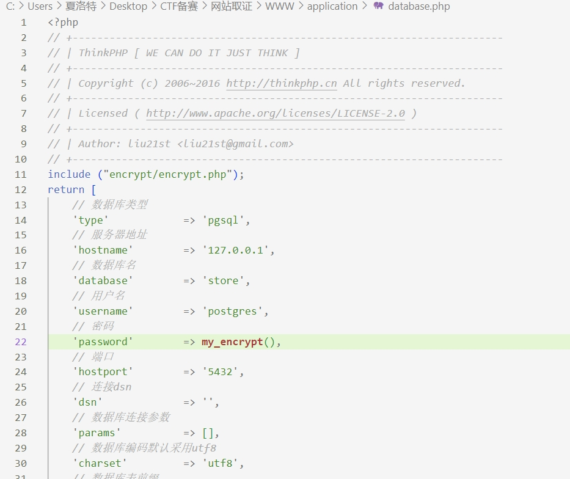

## [2022蓝帽杯]手机取证1
### 思路和过程：
- 全程从虚拟环境中查找图片627604C2-C586-48C1-AA16-FF33C3022159.PNG的图片，结果会找到几个路径，打开后可以查看其分辨率；

## [2023陇剑杯]Wireshark1_1
### 工具wireshark
### 思路和过程：
- 和正常一样的打开流量包查看，题目要被入侵的主机ip，寻找流量交互，把交互最频繁的几个ip仔细检查并提交（虽然第一个就提交错了）但是因为没有次数限制所以可以多尝试提交答案；

## [蓝帽杯 2022 初赛]网站取证_2---请提交数据库连接的明文密码
### 工具：在线php工具
### 思路：
- 打开www文件查看代码，题目要求找到数据库的连接密码，那么打开database这个文件，打开后可以看到数据库的连接信息

- 其中密码部分调用了一个加密函数my-encrypt，接着去打开这个php文件，由于个人不是很懂php，所以去网络查看参考资料，使用在线的php工具可以添加输出语句echo my_encrypt()来使得结果输出
- 得到flag为KBLT123；
### 思考：
- 在使用在线php工具时老是没有结果或者错位，最后发现是版本号选择不对...

## [OtterCTF 2018]General Info----------------参考网络资料
### 思路和过程：
- 首先查看一下镜像的信息
python2 vol.py -f /home/kali/Desktop/OtterCTF.vmem imageinfo
- 查看一下注册表
python2 vol.py -f /home/kali/Desktop/OtterCTF.vmem --profile=Win7SP1x64 hivelist
- 主机名会出储存在\REGISTRY\MACHINE\SYSTEM中的ControlSet001\Control\ComputerName\ComputerName里面
python2 vol.py -f /home/kali/Desktop/OtterCTF.vmem --profile=Win7SP1x64 printkey -o 0xfffff8a000024010 -K "ControlSet001\Control\ComputerName\ComputerName"
- 通过netscan来查看网络
python2 vol.py -f /home/kali/Desktop/OtterCTF.vmem --profile=Win7SP1x64 netscan

## [应急响应]welog1
### 工具：ai，cyberchef
### 思路和过程：
- 根据以前做过的日志题目，使用编辑器打开日志信息并仔细查看有问题的地方（一般是php或者长度非常长的信息语句），定位到可疑的一些语句192.168.150.1 - - [10/Mar/2023:08:19:46 +0000] "GET /index.php?id=0%27%20union%20select%201,0x223c3f70687020406576616c28245f504f53545b273362393064373564653234386365353562363665386533303837336236303030275d293b3f3e22,3,4%20into%20outfile%20%22/var/www/html/ShEll1.php%22; HTTP/1.1" 200 1194 "-" "Mozilla/5.0 (Windows NT 10.0; Win64; x64) AppleWebKit/537.36 (KHTML, like Gecko) Chrome/110.0.0.0 Safari/537.36"，然后打开ai模型给他让他分析这是什么，得到这是一种sql注入，放进编码网站中进行编码就可以得到注入的php，其中P的OST参数可以尝试提交flag。

## [陇剑杯 2021]SQL注入
### 学习盲注
