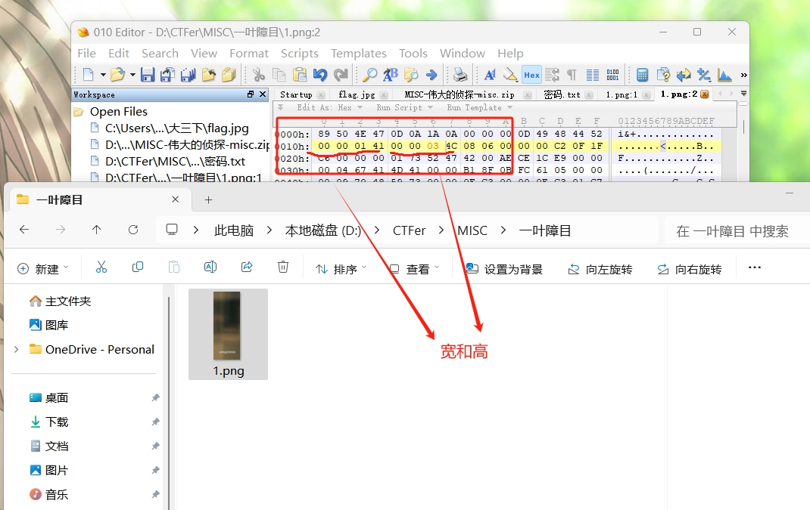

## [SWPU 2019]伟大的侦探
### 看到：
- 一个压缩包，打开后是一个txt文件叫密码，还有一个加密的压缩包
### 解题思路和过程：
- 尝试爆破压缩包发现没有成功，并非单纯的数字，打开010观察二进制文件看看是否是伪加密，结果是正常加密。
- 查看一点点提示后发现是需要在010中打开txt文件并切换到EBCDIC模式来观察编码，由此得到了压缩包密码。
- 解压后里边是跳舞的小人图片，对照小人表后得到编码和flag。

## 宽高隐写
### 看到：
- 一个png图片，
### 解题思路和过程：
- 用010打开图片，这里注意打开后第二行前4个字节是宽，再4个字节是高，尝试进行修改。

