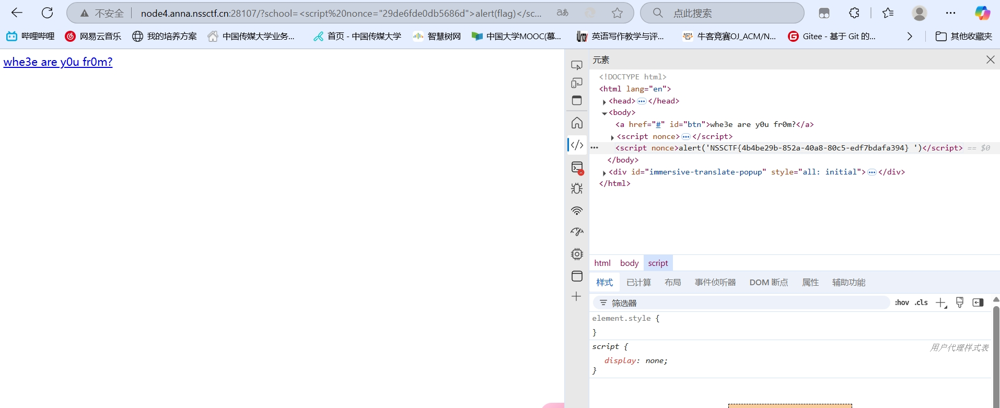
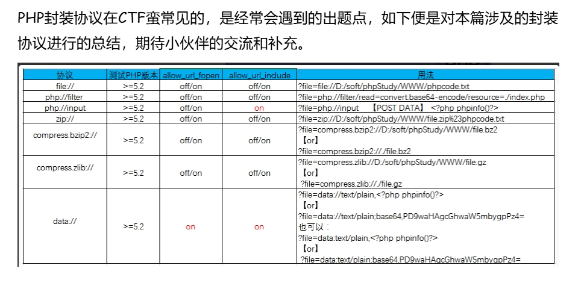
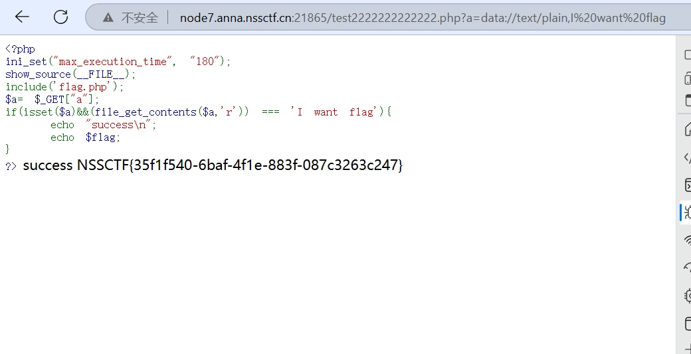
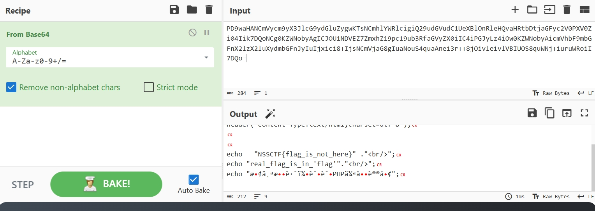
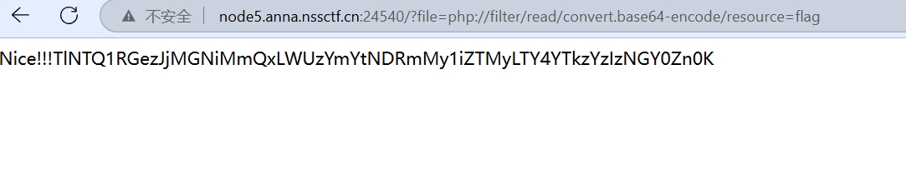
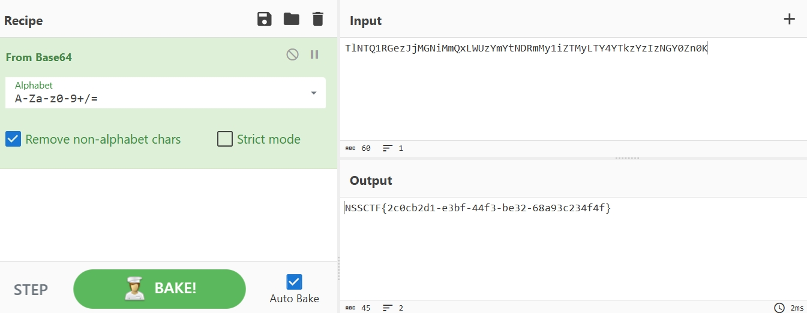
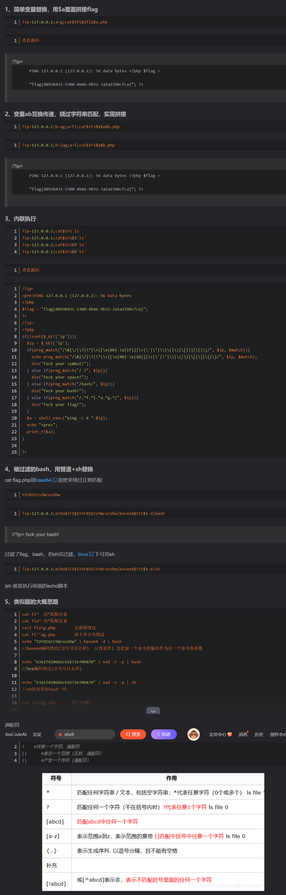
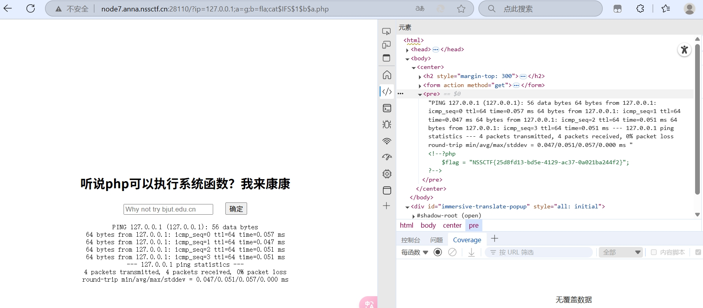

## [AFCTF 2021]BABY_CSP
### 看到：
- 网页，url参数为school，随机的从4个元素中输出一个，如果自己修改的话输入什么输出什么
### 思路和过程：
- 观察标签为xss，去学习相关知识得知是一种注入攻击（跨站点脚本攻击），分为反射（用户输入（如 URL 参数、表单）被服务器直接反射到页面，未经充分过滤，通过 URL 或输入点注入脚本。），存储（恶意脚本存储在服务器（如数据库），每次访问页面都会执行在评论、用户名等持久化输入中注入脚本）和DOM型（客户端 JavaScript 直接操作用户输入并写入 DOM，未经清理，找到 JavaScript 处理输入的代码）的xss，这里尝试使用<sprite>alter（'1'）</sprite>标签和别的orror进行xss测试，但是网页都没有什么动静，查看f12的网页元素是输入什么输出什么。
- 学习别的标签csp，得知是一种内容安全策略，用来限制脚本的执行和触发，相当于一种白名单机制，通过查看响应头发现在security-policy中有一个nonce值，这是一个随机数用来限制执行标签的，这里指定了一个固定的值，尝试在上面的测试标签后面带着这个nonce值，结果触发xss漏洞，弹出弹窗了，那么使用alter（flag）来进行查看，在f12中显示出了flag。


## [SWPUCTF 2021 新生赛]PseudoProtocols
### 标签：php伪协议，文件包含，php
### 题目描述：
- 一个网站显示要求你寻找hint.php,直接访问是空白
### 思路和过程：
1. 进行尝试,url参数是index.php?wllm=,直接访问hintphp是空白,访问index.php会重定向跳转,查看响应头中没有什么东西.查看源码,查看flag.php也是空白.
2. 去网络学习php伪协议知识,这里分为filter,php,data,zip等封装使用

3. 然后选择使用php://filter查看hintphp的内容,弹出了源码,exp为wllm=php://filter/read/convert.base64-encode/resource=hint.php,然后显示出了一段base64加密数据,解密后发现是让你去访问test22222222.php.,访问后显示了另一段php代码,内容为
```
<?php
ini_set("max_execution_time", "180");
show_source(__FILE__);
include('flag.php');
$a= $_GET["a"];
if(isset($a)&&(file_get_contents($a,'r')) === 'I want flag'){
    echo "success\n";
    echo $flag;
}
?> 
```
4. 这里可以使用两种方法,一是使用input后传入POSTDATA参数iwantflag来获取,二是在url中直接使用data://text/plain,I want flag后可以获得flag.


## [SWPUCTF 2022 新生赛]ez_ez_php
### 标签：php伪协议,文件包含
### 题目描述：
- 打开是一段php
```
<?php
error_reporting(0);
if (isset($_GET['file'])) {
    if ( substr($_GET["file"], 0, 3) === "php" ) {
        echo "Nice!!!";
        include($_GET["file"]);
    } 

    else {
        echo "Hacker!!";
    }
}else {
    highlight_file(__FILE__);
}
//flag.php
```
- 传入参数file=php后显示nice！！！
### 思路和过程：
- 趁热打铁！！！
1. 这里可以使用php伪协议来进行文件包含，exp为file=php://filter/convert.base64-encode/resource=flag.php,弹出一段base64编码，解码后是一段显示flag不在这里的语句，真正的flag在‘flag’里面

2. 然后使用同样的伪协议php：//filter去访问flag无后缀，得到新的base64，解码后是正确的flag



## [GXYCTF 2019]Ping Ping Ping
### 标签：rce，空格绕过，WAF绕过
### 题目描述：
- 打开是一个网页有一个输入框，可以进行ping的指令，上面写着“听说php可以执行系统函数？我来康康”；
### 思路和过程：
- 随机ping几个地址可以ping通；这里查阅资料后想起可以使用管道符在ip后面执行操作(命令联合执行)，在ip后加上；或者|来执行ls命令，查看到本地有flag和index两个php文件。
- 然后使用cat flag来进行访问结果被拒绝，空格无法被执行，这里存在一些空格绕过包括:
```
${IFS}$9
{IFS}
$IFS
${IFS}
$IFS$1 //$1改成$加其他数字貌似都行
IFS
< 
<> 
{cat,flag.php}  //用逗号实现了空格功能，需要用{}括起来
%20   (space)
%09   (tab)
X=$'cat\x09./flag.php';$X       （\x09表示tab，也可以用\x20）
```
- 一一尝试后使用$IFS$发现可以绕过，但是flag无法被访问，先访问index查看源码
```
/?ip=
PING 127.0.0.1 (127.0.0.1): 56 data bytes
/?ip=
|\'|\"|\\|\(|\)|\[|\]|\{|\}/", $ip, $match)){
    echo preg_match("/\&|\/|\?|\*|\<|[\x{00}-\x{20}]|\>|\'|\"|\\|\(|\)|\[|\]|\{|\}/", $ip, $match);
    die("fxck your symbol!");
  } else if(preg_match("/ /", $ip)){
    die("fxck your space!");
  } else if(preg_match("/bash/", $ip)){
    die("fxck your bash!");
  } else if(preg_match("/.*f.*l.*a.*g.*/", $ip)){
    die("fxck your flag!");
  }
  $a = shell_exec("ping -c 4 ".$ip);
  echo "
";
  print_r($a);
}

?>
```
- 源码中有一个$a变量可以覆盖

- 最后构造payload进行绕过得到答案
